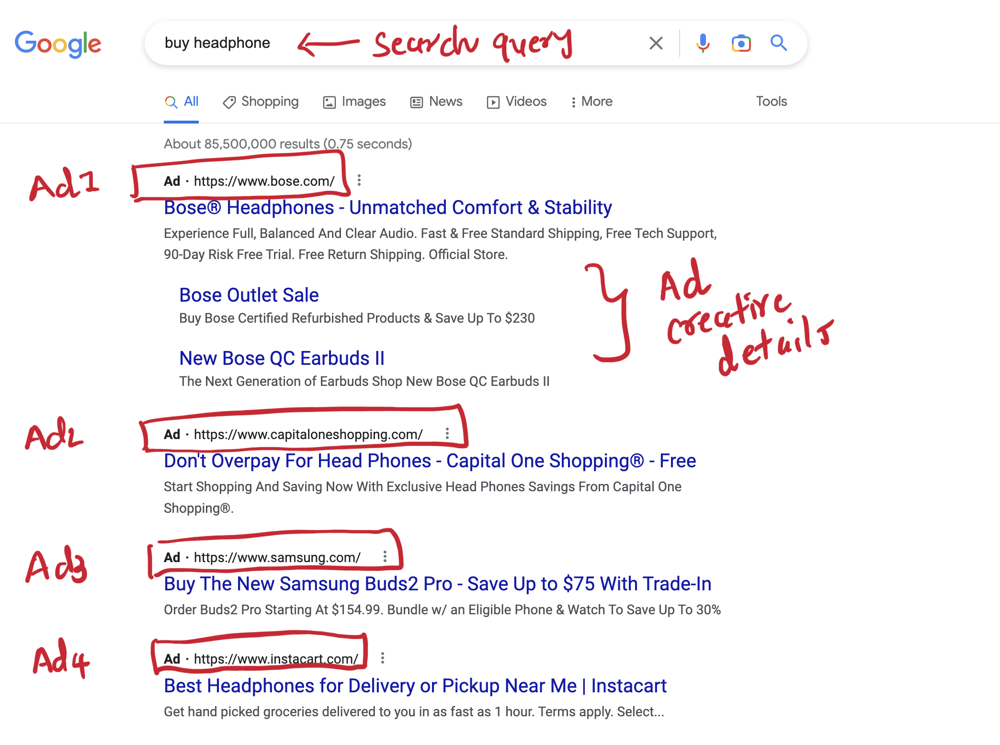
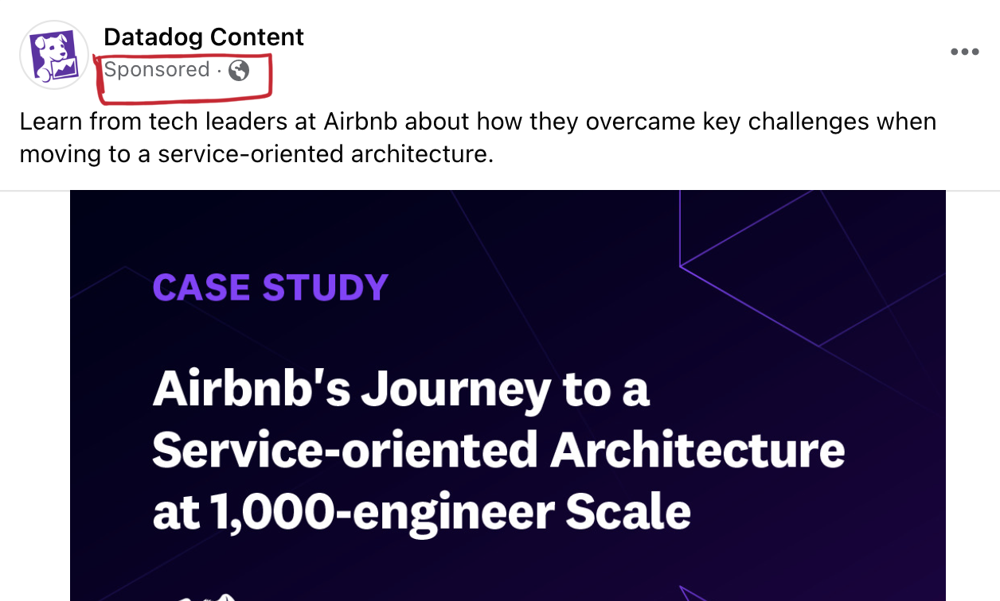
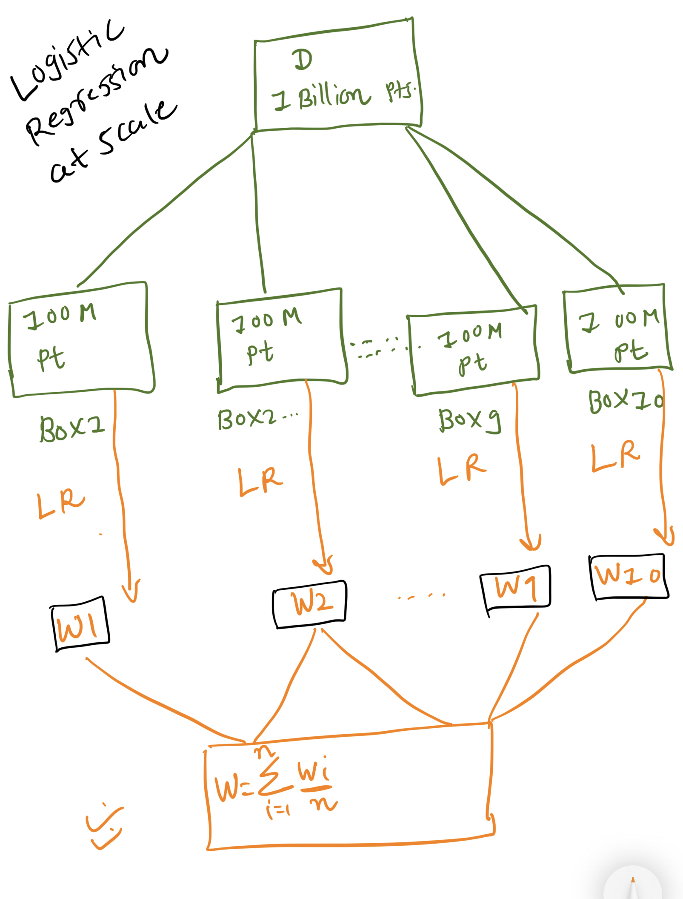

# **Thoughts on: Ad Click Prediction For Search**

Based on my experience and learning here are my thoughts on Ad Click Prediction For search Problem.

**Introduction**

Google, Facebook, Twitter, Linkedin, snap, and many more social media companies' revenue is primarily based on online advertisement. Google and Facebook made billions of dollars using machine learning-driven online advertising.

User Intent-based advertising, sponsored product advertising, context-based advertising, and personalization-based advertising all heavily relied on accurate, reliable ad click-through rate prediction.

**Question:**  **🤔**  **How Google, and Facebook made revenue through ads?**

**Google Example:**

When you are searching for any product on Google. Google will analyze your search query and combine it with contextual information, and user information to come up with the most relevant search results.

On top of the page, the first 3–4 search results will be sponsored ads pertinent to user search queries. When **users click on the ads** , Google **will earn revenue based on advertisement bidding.** We can consider it as **pay per click Model** , there are other models as well like pay-per-view, but we will focus on pay-per-click in this paper.

**Facebook Example:**

Facebook ads come in the form of feeds. Sometimes you are scrolling through feeds on Facebook, you may come across some videos/reels where sponsored were written. These are sponsored ads in form of your Facebook feed.

Google has very limited space (slots) on the web page, and It can not display all the sponsored ads, All the advertisers are competing for the slots, and sponsors bid for ads.

All the advertisers come up with keywords for which Google will match the ads. If the user provided a query matching the advertiser-chosen keywords then ads will be selected for further stages. Advertisers also provide ad creative which includes the text of the ad, description of ads, link, and other metadata information.

**Business Problem:**

Google wants to maximize this revenue, Google revenue largely depends on Ads, More click on ads more revenue for Google.

More Click — — — — — — — — — → More Revenue

Google can not show any random ads to users, e.g If the user is searching for headphones and If it provides ads for Toyota Car. Not only ads won't be clicked by users, but Users will switch to other search engines, and there is a risk of customer retention.

Google wants to maximize revenue by keeping search results and ads relevant to user context and search queries. Given the thousands of advertisers bidding for ads on Google, Google needs to display 3–4 most relevant sponsor ads based on user queries that will maximize its revenue.

**Machine Learning In Ad Click Prediction**

When a User search in google, Google will match the search query q to advertiser-chosen keywords, then generate an initial set of candidates ads, In later stages, Ads will be shown based on how relevant the ad is based on the user search query and using user-contextual information, how much revenue it will generate if it is clicked. For each of the candidate ads, we will get the probability of clicking, based on the probability google will rank the ads based on how much revenue it generates if clicked, how relevant it is to the user's search query, and show the top 3–4 ads.

We need to estimate

**P(Ad\_click | search query, user information, ad creating)**

**Basic calculation For Revenue**

| Ad | Probability of Ad Click | Bidding per click | Expected revenue per click |
| --- | --- | --- | --- |
| A | 0.3 | 10 | 3 |
| B | 0.1 | 50 | 5 |
| C | 0.097 | 100 | 9.7 |

Though Ad A has a higher probability of being clicked, Ad B has higher revenue per click, so Google should show Ad B first, and then Ad A

🤔 **What is CTR (Click Through Rate)**

CTR is defined as the ratio of the **number of clicks ad received** divided by a **number of times the ad displayed** _**(impression)**_ or shown to the user.

There is one more terminology we need to understand before we discuss how to solve this ML problem.

🤔 **What is Positional Bias**

"[Position bias](https://arxiv.org/abs/1802.06565)" describes the tendency of users to interact with items on top of a list with higher probability than with items at a lower position in the list, regardless of the items' actual relevance.

In our ad click prediction, the first click has a high chance of being clicked because of positional bias, because the user mostly scrolled down from top to bottom.

You can read more on Position Bias and how to mitigate it in this amazing Blog created by [eugeneyan](https://eugeneyan.com/writing/position-bias/).

**Mapping Business Problem to Machine Learning Problem:**

We want to predict the probability of ad clicks, basically, for each ad impression, we would like to know what is the probability of clicks. This means we will formulate this problem as a Binary classification problem where positive class means ad click and negative for No Click.

We can also solve this problem as a ranking problem where we would like to rank ads based on what is the chance of being clicked, how relevant is to user queries, and how much revenue they will generate. Traditional Matrix factorization is not a good way to solve this problem, because matrix factorization won't consider context-level information.

In this paper, I will solve this problem as a binary classification problem.

**Objective Function**

Google's objective is maximizing revenue, When users click on the ads then Google will earn revenue, so we would like to optimize for the probability of ad clicks, the more accurate our prediction probability for ad clicks, the more revenue it will generate.

**Minimize Log Loss**

Log-loss is indicative of how close the prediction probability is to the corresponding actual/true value (0 or 1 in case of binary classification). In this problem, our objective is to minimize log loss

P = Probability prediction of click

(1-P) =probability prediction of not clicking

Y = 1 for ad Click

1- Y = 0 for not click

we want to minimize Log loss which is equivalent to maximizing the probability of clicks.

**KPI/ Metric**

1. **Log Loss**

    **Log-loss** is indicative of **how close the prediction probability is to the corresponding actual/true value** (0 or 1 in case of binary classification)

    **Log Loss** is a great choice for a loss function when a higher prediction in the probability of click is very important, as it **penalizes small deviation in probability value**.

2. **AUC**

    AUC is a better metric If we are more interested in ranking ads not the probability of clicks.

| Model 1 | Ad | True Label | Predicted probability | Rank | AUC = 1 | Log Loss = 0.11 |
|---------|----|------------|-----------------------|------|---------|-----------------|
|         | A  | 1          | 0.99                  | 1    |         |                 |
|         | B  | 0          | 0.12                  | 3    |         |                 |
|         | C  | 1          | 0.81                  | 2    |         |                 |

| Model 2 | Ad | True Label | Predicted probability | Rank | AUC=1 | Log Loss=0.37 |
|---------|----|------------|-----------------------|------|-------|---------------|
|         | A  | 1          | 0.9                   | 1    |       |               |
|         | B  | 0          | 0.4                   | 3    |       |               |
|         | C  | 1          | 0.6                   | 2    |       |               |

**Both Model 1 and Model 2 have an AUC score of 1,** because Both of these models have the same ranking. AUC does not care about probability, but ranking.

If we are interested in Probability value then Log Loss is a better metric, then we choose Model 1 as it has less Log Loss (0.11) compared to Model 2(0.37)

**Constraints**

- Relevant Search Ads
- Low Latency
- Interpretability
- Parallelizable Training

**DataSet**

Google has Billion of Search Logs. Each row in the search log corresponds to an ad impression. It also has information If the ad impression converted to click or not

Log File ———[READING]——— \< X Features, Y = is click \> ?

**Features:**

- **Demographic Feature**

    - Geo Location Feature - Country, State, City, Zip
    - Age
    - Gender
    - IP Location
    - Device Type - iPhone, Android, Mobile, I-pad, Desktop

- **Search Keywords**
  - Ad Title
  - Ad Creative
- Advertiser Features
- Rating Information
- Day Of week
- Is Festival Season/ Holiday
- **Historical CTR Feature**
  - User Historical CTR
  - Ad Historical CTR
  - Advertiser CTR

**How to correct for Position bias?**

Position Bias is a huge topic, and I don't want to diverge from the different discussions in this paper, You can read more on Position Bias and how to mitigate it in this amazing Blog created by[eugeneyan](https://eugeneyan.com/writing/position-bias/).

**Modelling:**

**Stage 1: Generate Candidate ads**

Google has thousands of ads for each search query, it is very difficult to come up with the best options in a low time. We need to narrow down our search space.

_Google will match search query (q) to advertiser-chosen keywords, then generate an initial set of candidates ads_

**Stage 2: Predicting using ML Model on candidate ads**

**Choice of Classification Models**

**1) Naive Bayes**
- **Pros**
  - Low Latency
  - Interpretability
- **Cons**
  - Independence assumption is not always correct
  - Probability calibration is required ( due to independence assumption)

**2) Logistic Regression**

- **Pros**
  - Low Latency at test time
  - Interpretability, due to coefficient value
  - It will **minimize log loss** and our **metric for this problem is log loss** , so this is one of the **best choice**
- **Cons**
  - Multi colinearity will hurt Interpretability
  - If Data is not linearly seperable then Used Feature interaction

**3) SVM**

- **Pros**
  - Low Latency
- **Cons**
  - Not optimising for Log Loss

**4) Gradient Boosted Decision Tree (GBDT)**

- **Pros**
  - Minimize GBDT with Log Loss
  - Good for low latency, Get Interaction of features easily
- **Cons**
  - Not easily parallelizable for large training data
  - Training on Large Dataset is hard

**Some Training and Performance Details:**

- Time based splitting for Training
- Monitor Log Loss

**Modeling at Scale**

- Distributed GBDT
- Logistic Regression at Scale

**Productionization and Monitoring**

🤔How to address these issue?

- *Biggest Challenge in Deploying Ad Click Prediction Model_:*
    - Low Latency ( \< 1 ms)
    - Extremely parallelizable ( Handle 10K Query per Second - High Throughput)
- *Choice of Architecture and Model:*
    - For Low Latency Logistic Regression, and GBDT is a good choice.
    - Cache to store Model weights
    - Use Load Balancer to handle Large Concurrent requests

- *Constantly Monitoring Model:*
    - Check API though put, compare the probability of click vs actual click
- *ReTraining Approach:*
    - Over the time Check Log Loss performance, If Log Loss decreases by some threshold, retrain model
    - Logistic Regression can be trained incrementally, GBDT is hard to train incrementally
- *How to Handle Cold Start Problem:*
    - We might not have User Level features, or Ad Level feature for the new ad, or new user **, We don't have Historical Feature based on Ad and User**
    - we still Have User location, User device type, Model Name, User IP Location, **Search Query and Ad Similarity Feature**
    - Not a Major Issue

- *Real-Time/ Online Training*
    - [FTRL-Proximal online learning algorithm](https://research.google/pubs/pub41159/)

**Reference:**
- [**Intuition-behind-log-loss**](https://towardsdatascience.com/intuition-behind-log-loss-score-4e0c9979680a#:~:text=is%20dependent%20on.-,What%20does%20log%2Dloss%20conceptually%20mean%3F,is%20the%20log%2Dloss%20value.)
- [**Google's Excellent Case Study on Ad Click Prediction**](https://ai.google/research/pubs/pub41159)
- [**Google Scholar Page: Ad Click Prediction**](https://scholar.google.co.in/scholar?hl=en&as_sdt=0%2C5&q=ad+click+predictrion&btnG=)
- [**Mobile CTR**](https://towardsdatascience.com/mobile-ads-click-through-rate-ctr-prediction-44fdac40c6ff)
